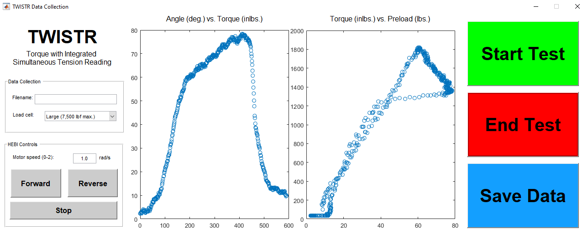

# TWISTR
***T***orque ***W***ith ***I***ntegrated ***S***imultaneous ***T***ension ***R***eading - This device runs torque-tension tests to determine fastener torque and preload.

Example user interface with data output after test of 8-32 SHCS:

# Instructions for Set-up and Use
