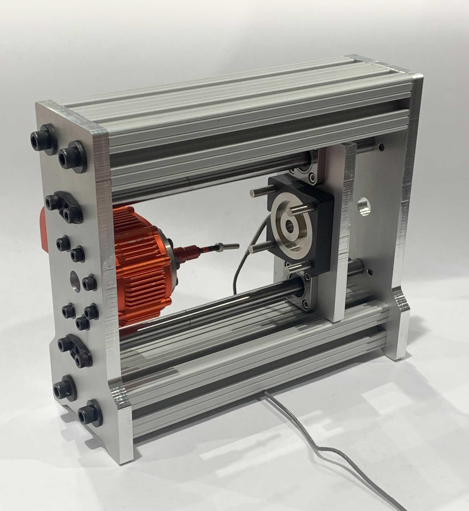

# TWISTR
***T***orque ***W***ith ***I***ntegrated ***S***imultaneous ***T***ension ***R***eading - This device performs torque-tension testing to determine fastener torque and preload.

# Instructions for Set-up and Use
